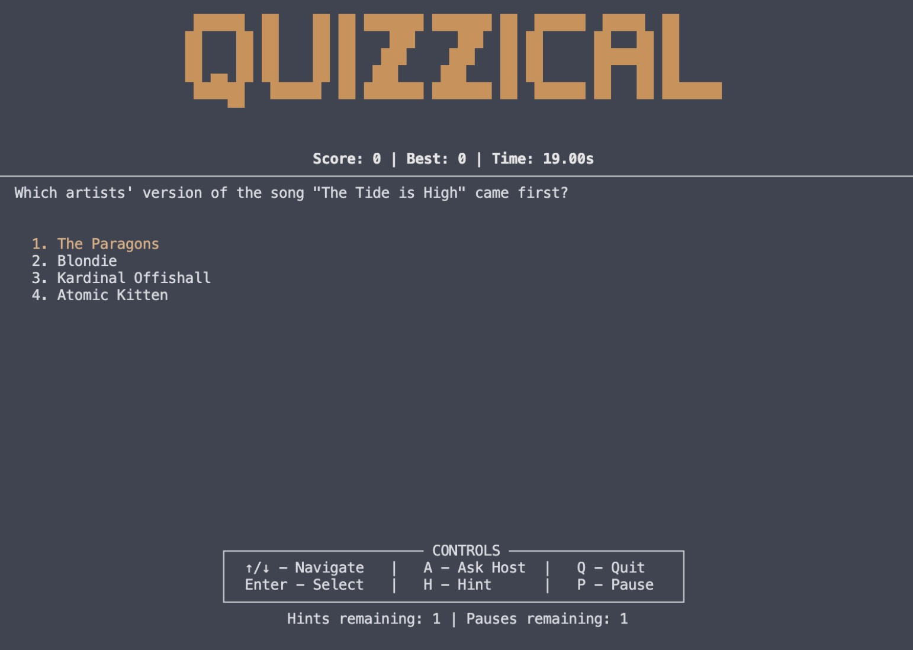

# How to run this project
- run `pip install requests` in Terminal (if you don't have requests installed)
- run `python Quizzical.py` in Terminal
- Follow the instructions to play the game

---
# Game rules
- You will be given a question and 4 options to choose from
- Select the correct answer to earn points
- For each question, you have 20 seconds to answer
- You have 3 chances to play the game in one session
- You can ask the host for answer by entering `A` on keyboard
- You can use the hint by entering `H` on keyboard
- A hint can be used only once and can eliminate 2 options for you
- You can enter the `P` on keyboard to pause the game
- You can enter the `Q` on keyboard to quit the game at any time

---
# Game Interface

The game features a terminal-based interface with:
- ASCII art title "QUIZZICAL"
- Real-time score tracking and timer display
- Multiple choice questions with numbered options
- Interactive controls panel showing all available commands
- Hints and pause functionality indicators

---
# API
- This game uses the [Open Trivia DB API](https://opentdb.com/api_config.php)

